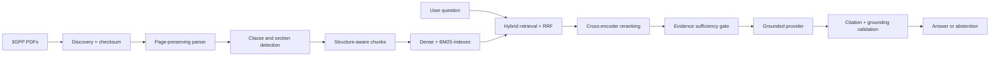

# TeleRAG architecture

TeleRAG is a modular monolith whose answer path is deliberately evidence-first.

## Trust boundaries

PDF text is untrusted data. It is placed in a clearly delimited evidence block
and must never be interpreted as instructions. Provider output is untrusted until
its schema, source IDs, and grounding are validated.

## Provenance model

Each chunk stores specification, title, release, version, clause, section title,
page range, source filename, source type, document checksum, and content hash.
Source IDs such as `SOURCE_01` are assigned per response and are only valid for
the evidence set returned with that response.

## Failure handling

- Invalid corpus paths fail before processing.
- Release mismatches are recorded and can be skipped with `--strict-release`.
- Missing PDF dependencies produce a controlled per-document failure.
- Empty or irrelevant retrieval abstains before generation.
- Invalid provider JSON, citations, or grounding results abstain safely.
